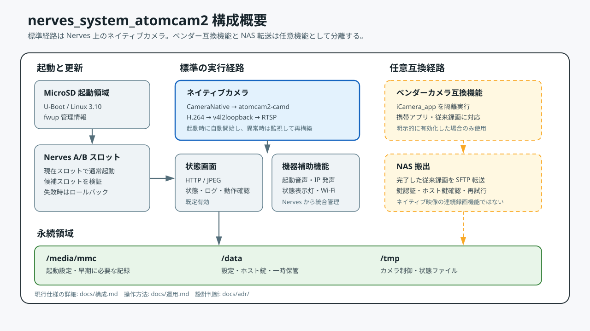

# nerves_system_atomcam2

[](https://github.com/piyopiyoex/nerves_system_atomcam2/actions/workflows/ci.yml)
[](https://api.reuse.software/info/github.com/piyopiyoex/nerves_system_atomcam2)

Atom Cam 2 で Elixir と Nerves を動かすための実験的な Nerves system です。

現行版は `0.6.0` です。Nerves の起動、ネットワーク接続、SSH、A/B
ファームウェア更新に加え、ネイティブカメラ、RTSP 配信(映像 + マイク音声)、
状態画面、起動時の音声案内を実機で確認しています。

初めて利用する場合は [はじめに](docs/はじめに.md)、仕組みを確認する場合は
[構成](docs/構成.md)、日常の操作は [運用](docs/運用.md) を参照してください。

[](docs/構成.md)

## 現在の状態

| 項目 | 状態 |
| --- | --- |
| Nerves 起動 | MicroSD から起動し、Elixir アプリケーションを実行 |
| ネットワーク | 2.4 GHz Wi-Fi、任意の USB 有線 LAN、mDNS |
| 遠隔操作 | SSH 公開鍵認証、ターゲット IEx、SFTP |
| ファームウェア更新 | A/B スロット、候補確認、失敗時のロールバック |
| ネイティブカメラ | 既定で起動。H.264、JPEG、夜間切替、状態表示に対応 |
| RTSP | ネイティブカメラと一体で起動し、`8554` 番ポートから H.264 映像とマイク音声を配信 |
| 状態画面 | 既定で起動。映像、状態、ログ、動作確認を表示 |
| ベンダー互換機能 | 任意。標準 Atom アプリと録画機能を必要とする場合だけ使用 |
| NAS 転送 | SFTP 転送基盤は実装済み。実際の NAS ごとに運用検証が必要 |

ネイティブカメラは現在の標準経路です。ベンダー互換機能は、標準 Atom アプリや
既存の録画機能が必要な場合に限って使用する互換経路です。両方を同時に動かす運用は
保証していません。

> このプロジェクトは実験段階です。無人運用や重要用途へ導入する前に、停電、反復再起動、
> 長時間運転、温度、記録媒体の破損、ネットワーク断を利用環境で検証してください。

## 主な機能

- 標準的な Nerves アプリケーション開発手順
- VintageNet による Wi-Fi と有線 LAN
- mDNS、SSH、ターゲット IEx、SFTP
- `/data` の永続データ領域
- A/B スロットによる安全な遠隔更新
- `atomcam2-camd` によるネイティブ映像取得と H.264 配信
- `atomcam2-aicap` によるマイク音声の常時 RTSP 配信(H.264 と同一セッション)
- JPEG スナップショットと映像上の状態表示
- 夜間ビジョンと赤外線機器の操作
- 状態画面と機械可読な状態取得口
- 起動音、IP アドレス読み上げ、状態表示灯
- 任意のベンダーカメラ互換機能
- 任意の SFTP NAS 転送

## 最短の開始手順

Atom Cam 2、MicroSD カード、Nerves 開発環境、2.4 GHz Wi-Fi、SSH 公開鍵を
用意します。

```sh
cd examples/atomcam2_nerves_app

export MIX_TARGET=atomcam2
export MIX_ENV=prod
export NERVES_WIFI_SSID="your-ssid"
export NERVES_WIFI_PASSPHRASE="your-passphrase"

mix setup
mix firmware.burn
```

`mix firmware.burn` は選択した MicroSD カードを消去します。表示された機器名を
確認してから書き込んでください。

起動後は次のコマンドで接続します。

```sh
ping nerves.local
ssh nerves@nerves.local
```

映像(H.264)とマイク音声は次の URL で確認できます。

```text
rtsp://<機器のIP>:8554/video0_unicast
```

状態画面は次の URL です。

```text
http://<機器のIP>/
```

## 文書

- [文書案内](docs/README.md)
- [はじめに](docs/はじめに.md)
- [構成](docs/構成.md)
- [運用](docs/運用.md)
- [設計判断](docs/adr/README.md)
- [開発記録](docs/worklog/README.md)
- [変更履歴](CHANGELOG.md)
